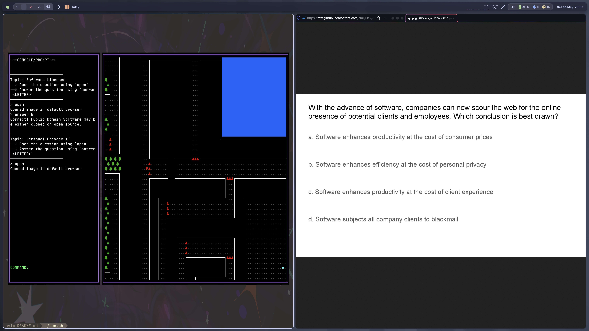

# ethics_game

A 2D CLI adventure game where the enemies are multiple choice questions regarding social and ethical issues in software design and development.



☆ Recycled engine from my old account: https://github.com/dturnip/explorer

## Requirements

- Python 3.11+
- Terminal emulator can render 256 colors
- Terminal emulator is equipped with a font that can render Nerd Font glyphs. Recommended fonts are included in `fonts/`. Font sizes `16.0`〜`24.0` are recommended.

## Kitty & Alacritty

- GPU accelerated terminals are great for this game as there will be less flickering and overall smoother performance. Both kitty and Alacritty will fail to render specific characters because `$TERM` is something other than `xterm-256color`. The below command fixes this problem (this is in `run.sh`):

```bash
export TERM=xterm-256color
```

## Known Issues

- Resizing the terminal window to a smaller size will crash the program
